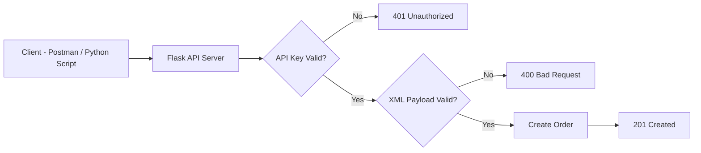
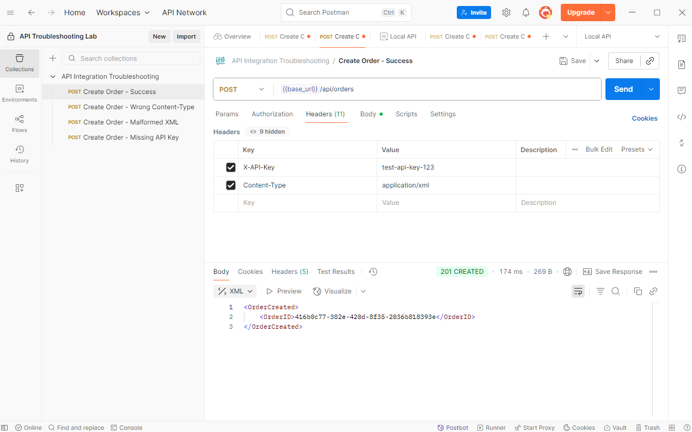
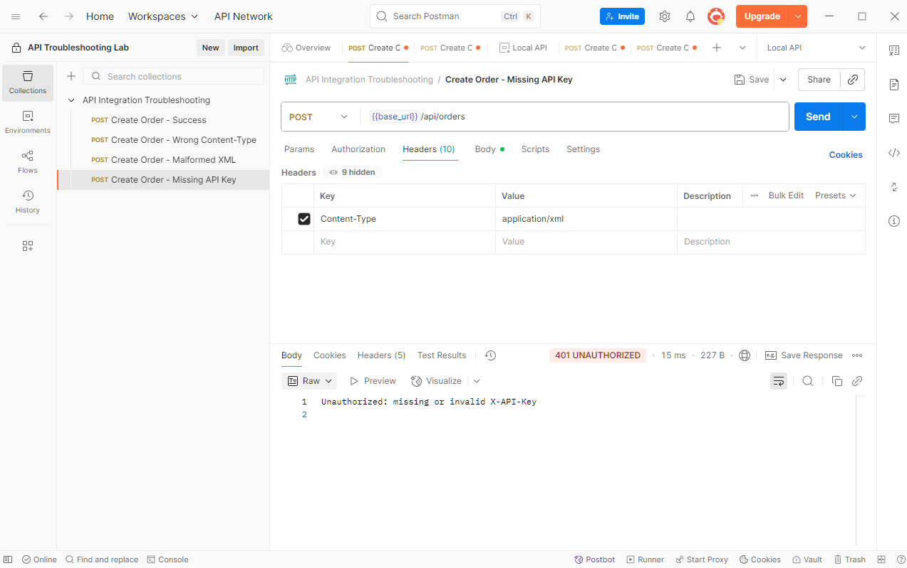
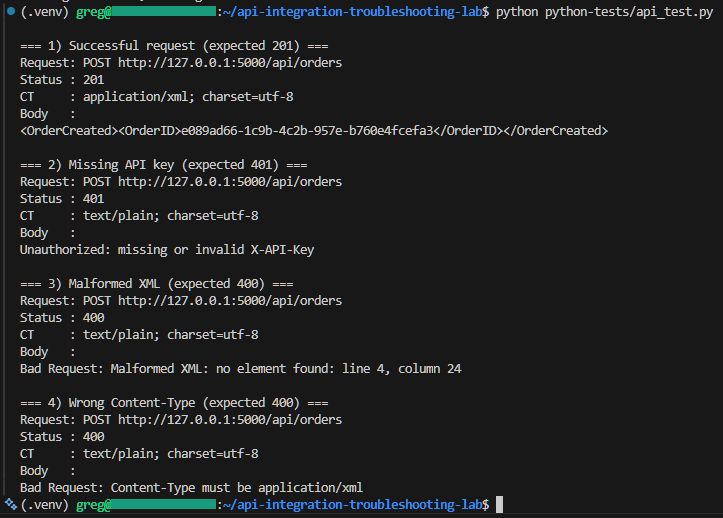

# API Integration Troubleshooting Lab

A small lab environment for reproducing and diagnosing common API
integration failures such as authentication errors, malformed XML
payloads, and incorrect request headers.

The repository includes a mock Flask API, example XML payloads, a
Postman collection, and a Python troubleshooting script used to
reproduce and investigate integration issues.

------------------------------------------------------------------------

## Overview

Many integration problems occur not because the API is unavailable, but
because requests are malformed or authentication is incorrect. This lab
simulates several common failure scenarios and demonstrates how they can
be reproduced and diagnosed using typical developer and support tools.

The goal is to provide a small, reproducible environment for practicing
API troubleshooting workflows.

------------------------------------------------------------------------

## Requirements

-   Python 3.10+
-   pip
-   Postman (optional, for manual testing)

------------------------------------------------------------------------

## Project Structure

    api-integration-troubleshooting-lab/
    │
    ├── api-server/
    │   ├── app.py
    │   └── requirements.txt
    │
    ├── python-tests/
    │   └── api_test.py
    │
    ├── xml-examples/
    │   ├── valid-order.xml
    │   └── malformed-order.xml
    │
    ├── postman/
    ├── screenshots/
    └── README.md

------------------------------------------------------------------------

## Running the Lab

Start the API server:

``` bash
cd api-server
python -m venv .venv
source .venv/bin/activate
pip install -r requirements.txt
python app.py
```

In another terminal, run the troubleshooting script:

``` bash
python python-tests/api_test.py
```

------------------------------------------------------------------------

## Architecture

The API validates authentication headers, parses XML payloads, and
returns appropriate HTTP status codes when errors occur.



------------------------------------------------------------------------

## Example Failure Scenarios

### Successful Request

Valid XML payload and authentication header.

Expected response:

    HTTP 201 Created

Example response:

    <OrderCreated>
      <OrderID>...</OrderID>
    </OrderCreated>

------------------------------------------------------------------------

### Authentication Failure

Request sent **without API key header**.

Response:

    401 Unauthorized

Cause:

Missing authentication header.

Fix:

    X-API-Key: test-api-key-123

------------------------------------------------------------------------

### Malformed XML Payload

Broken XML payload sent to API.

Response:

    400 Bad Request
    Malformed XML

Cause:

Invalid XML structure.

------------------------------------------------------------------------

### Incorrect Content-Type

Payload sent with the wrong header.

Response:

    400 Bad Request
    Content-Type must be application/xml

Cause:

Incorrect request header.

------------------------------------------------------------------------

## Example Requests

### Successful Request (Postman)



### Authentication Failure



### Python Troubleshooting Script



------------------------------------------------------------------------

## Future Improvements

Possible extensions:

-   OAuth authentication support
-   JSON API version
-   Request logging and tracing
-   Containerised test environment
