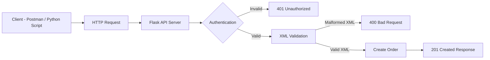

## Architecture Overview

```mermaid
flowchart LR

A[Client - Postman / Python Script]
--> B[HTTP Request]

B --> C[Flask API Server]

C --> D{Authentication}

D -->|Invalid| E[401 Unauthorized]

D -->|Valid| F[XML Validation]

F -->|Malformed XML| G[400 Bad Request]

F -->|Valid XML| H[Create Order]

H --> I[201 Created Response]
```