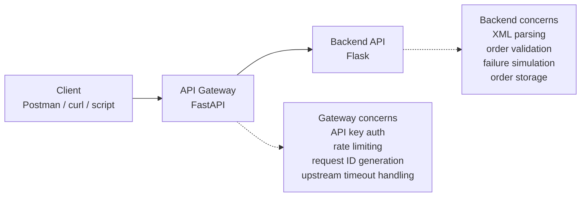
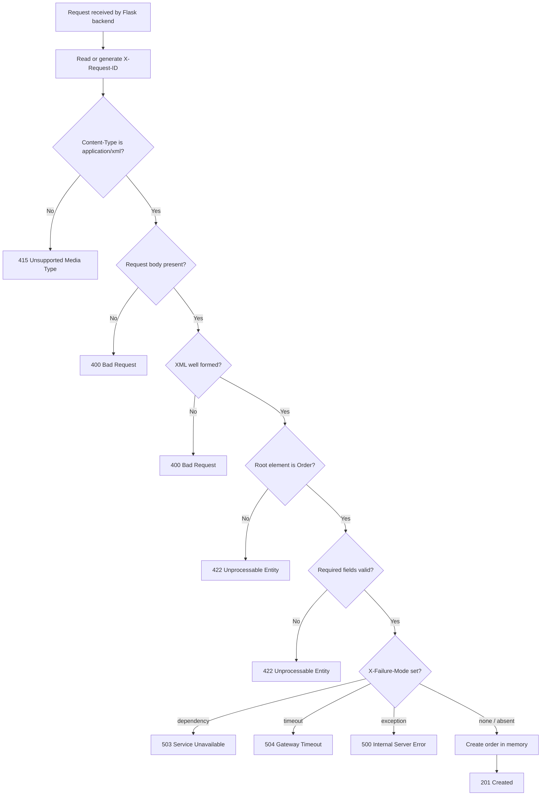

# Backend Architecture

This document describes the backend service architecture for the API Troubleshooting Lab.

The backend is a Flask service responsible for XML order handling, validation, controlled failure simulation, in-memory order storage, and trace-aware responses.

Authentication, rate limiting, and the main client entry point are handled by the gateway service, not by the backend.

---

## System Context



---

## Request Flow

Normal client traffic should enter through the gateway:

```text
Client
  │
  ▼
API Gateway
  │
  ├─ validates API key
  ├─ applies rate limiting
  ├─ creates or forwards X-Request-ID
  └─ forwards valid requests
  │
  ▼
Backend API
  │
  ├─ checks content type
  ├─ parses XML
  ├─ validates order fields
  ├─ applies failure simulation if requested
  └─ returns response
```

---

## Backend Request Flow



---

## Backend Responsibilities

The backend is responsible for:

- accepting XML order requests
- validating XML structure and required fields
- enforcing a valid order schema
- simulating predictable failure modes
- storing created orders in memory
- returning `X-Request-ID` for trace correlation
- emitting structured logs for troubleshooting

---

## Gateway Responsibilities

The backend does **not** handle API key authentication.

The gateway is responsible for:

- API key authentication
- rate limiting
- exposing the main client-facing endpoint
- forwarding requests to the backend
- propagating `X-Request-ID`
- handling upstream timeout behaviour

---

## Main Backend Endpoints

| Method | Endpoint | Purpose |
|---|---|---|
| `GET` | `/health` | Backend health check |
| `POST` | `/api/orders` | Create an order from XML |
| `GET` | `/api/orders/<order_id>` | Retrieve an order from in-memory storage |

---

## Expected XML Payload

```xml
<Order>
  <CustomerID>12345</CustomerID>
  <ProductID>ABC123</ProductID>
  <Quantity>2</Quantity>
</Order>
```

---

## Failure Simulation

The backend supports controlled failure simulation using:

```text
X-Failure-Mode
```

Allowed values:

| Value | Result |
|---|---|
| `dependency` | `503 Service Unavailable` |
| `timeout` | `504 Gateway Timeout` |
| `exception` | `500 Internal Server Error` |

This makes the lab useful for testing gateway behaviour, troubleshooting workflows, and request tracing across service boundaries.

---

## Observability

The backend supports trace-aware troubleshooting by using `X-Request-ID`.

When a request arrives:

1. The backend reads the incoming `X-Request-ID`.
2. If one is not present, it generates one.
3. The value is written to logs.
4. The same value is returned in the response headers.

This allows a single request to be followed across:

```text
client → gateway logs → backend logs → response headers
```

---

## Notes

This backend intentionally keeps storage in memory and failure simulation simple.

The purpose is not to model a complete production order system. The purpose is to create a controlled troubleshooting environment that demonstrates request validation, failure isolation, gateway/backend separation, and observability.
